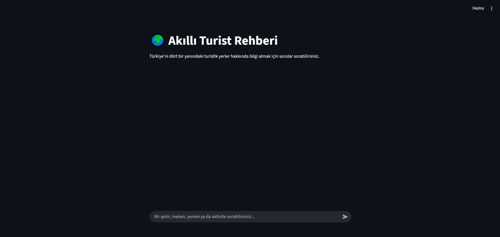

streamlit run streamlit_tourist_bot.py
# Smart Turkey Tourist Guide Chatbot

A set of chatbot applications that provide information about Turkish tourism using local language models. The project includes both web and terminal interfaces with different interaction modes.

## Project Structure

### requirements.txt
Contains all Python dependencies needed to run the applications. Key packages include:
- **streamlit** (1.51.0): Web application framework
- **langchain** (0.3.9) & **langchain-community** (0.3.9): AI orchestration framework
- **ollama** (0.6.0): Interface for local LLM models
- **pydantic** (2.12.3): Data validation
- Additional supporting libraries for HTTP requests, data processing, and async operations

### streamlit_tourist_bot.py
Basic web interface version that displays complete responses after generation.

**What it does:**
- Creates a web chat interface using Streamlit
- Maintains conversation history across interactions
- Uses Llama 3.2 3B model via Ollama locally
- Specialized for Turkish tourism topics (cities, historical sites, local foods, transportation)
- Shows user and AI messages in distinct chat bubbles

**How it works:**
- Stores chat history in session state memory
- Combines system instructions with conversation history for each query
- Processes complete responses before displaying them

### streamlit_tourist_bot_streaming.py
Enhanced web version that displays responses in real-time as they're generated.

**What it does:**
- Shows AI responses token-by-token as they're produced
- Provides more engaging user experience with live typing effect
- Uses custom callback handler to integrate streaming with Streamlit
- Maintains same tourism-focused functionality as basic version

**Technical approach:**
- Implements StreamHandler class to process tokens incrementally
- Uses empty placeholder elements for dynamic content updates
- Enables streaming mode in ChatOllama configuration
- Preserves conversation memory across sessions

### terminal_tourist_bot.py
Command-line version for users who prefer terminal interaction.

**What it does:**
- Runs in terminal/command prompt
- Continuous chat loop until user types "quit"
- Same tourism guidance functionality as web versions
- Simple text-based interface

**Operation:**
- Initial welcome message explains capabilities
- Processes user inputs through local Llama model
- Maintains conversation context using memory buffer
- Displays AI responses in terminal after full generation

## Setup and Installation

1. Install Python dependencies:
   ```bash
   pip install -r requirements.txt
   ```
Install Ollama from https://ollama.com/

Download the language model:

```bash
ollama pull llama3.2:3b
```
Run desired application:

```bash
streamlit run streamlit_tourist_bot.py
# or
streamlit run streamlit_tourist_bot_streaming.py
# or
python terminal_tourist_bot.py
```
## Model Information
Uses Llama 3.2 3B - a 3-billion parameter open-source language model from Meta, optimized for local operation. The model is configured to act specifically as a Turkish tourism guide, providing information about destinations, cultural sites, local cuisine, and travel logistics within Turkey.

## Usage Notes
All versions share the same core functionality but offer different user experiences:

Terminal version: Lightweight, no GUI dependencies

Basic Streamlit: Complete responses, web interface

Streaming Streamlit: Real-time response display, most engaging UX

The system is designed to operate entirely locally, ensuring privacy and no dependency on external APIs.



